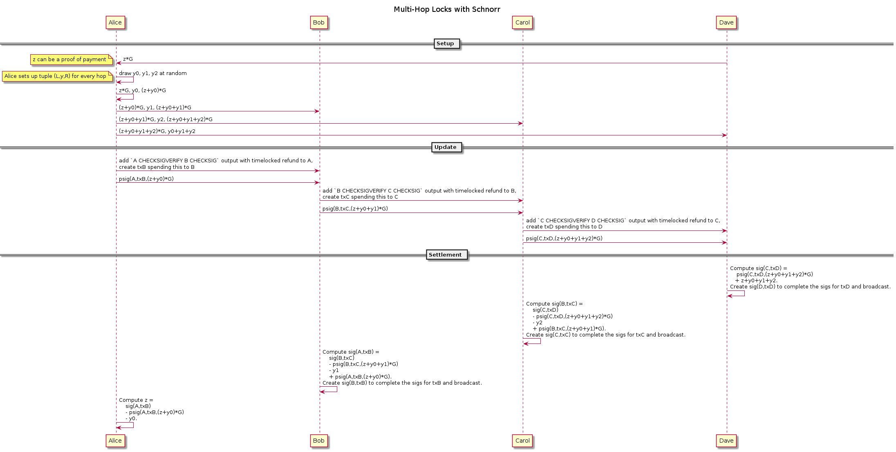

Multi-Hop Locks from Scriptless Scripts
===========================

Multi-hop locks are protocols that allow two parties to exchange coins and proof of payment without requiring a mutual funding multisig output.
Instead, they are connected through intermediate hops such that every hop has a shared funding multisig output with the next hop.
Multi-hop locks based on cryptographic hashes instead of scriptless scripts are used in the [Lightning Network protocol version 1.0](https://github.com/lightningnetwork/lightning-rfc) to route payments.

Scriptless script multi-hop locks were introduced in a [post to the mimblewimble mailing list](https://lists.launchpad.net/mimblewimble/msg00086.html) and formally defined in the paper [Privacy-preserving Multi-hop Locks for Blockchain Scalability and Interoperability](https://eprint.iacr.org/2018/472.pdf).
By using scriptless scripts they result in smaller transactions which look like regular transactions and therefore improve privacy.
More importantly, they allow [payment decorrelation](https://medium.com/@rusty_lightning/decorrelation-of-lightning-payments-7b6579db96b0) which means that hops in a multi-hop lock can not determine (absent timing and coin amount analysis) if they are on the same path, i.e. they don't know if they are forwarding the same payment.
Correlation attacks are especially problematic if the first and last intermediate hops are colluding because they would learn source and destination of a payment.
In addition, scriptless script multi-hop locks enable improved proof of payment and atomic multi path payments (see below).


Notation
---
- `psig(i,m,T) := ki + H(R+T,m)*xi` is a partial 2-of-2 MuSig from user `i` for `m` with combined nonce `R` (note that `R` has nothing to do with the right lock `R` defined below and we won't use `R` to mean the nonce again).
- `adaptor_sig(i,m,T) := psig(i,m,t*G) + t`
- `sig(m,T) = psig(i,m,T) + adaptor_sig(j,m,T)` is the completed 2-of-2 MuSig from user i and j. It can be computed from a partial signature and an adaptor signature.


Protocol
---



In the setup phase the payee chooses `z` at random and sends the payer `z*G`.
The payer will set up the multi-hop locks such that a successful payment reveals `z` to her and only her.
Knowledge of `z` can be a proof of payment which is similar in concept to payment preimages in the Lightning v1.0 (see section below for details).

We picture the payment starting from the payer on the left side through intermediate hops to the payee on the right side.
The setup phase continues with the payer setting up a tuple `(Li,yi,Ri)` consisting of the *left lock* `Li` and *right lock* `Ri` for every hop `i` in the following way:
Every `yi` is a scalar uniformly chosen at random.
The payers own left lock `L0` is set to `z*G` which was previously received from the payer.
Now for every lock `Ri` for hop `0<=i<n` and `Lj` for hop `j=i+1` the payer sets `Ri <- Li + yi*G` and `Lj <- Ri` (see the diagram).

In the update phase adjacent hops add a multisig output to their off-chain transactions similar to how they would add an HTLC output in the Lightning v1.0.
Despite significant differences between v1.0 HTLCs and the outputs used to forward payments in scripless scripts multi-hop locks we continue to call the outputs HTLCs because they have the same purpose and work similarly on the surface.
Just like v1.0 HTLCs, scriptless script HTLCs have a time out condition such that the left hop can reclaim her coins if the payment fails.
But otherwise scriptless script HTLCs are plain 2-of-2 MuSig outputs and the hashlock is only implicitly added to the output only when a partial signature is received (see below).
For demonstration purposes we assume [eltoo](https://blockstream.com/eltoo.pdf)-style channels which means that both parties have symmetric state and there's no need for revocation.

If the payment does not time out, the coins in the scriptless script HTLC output shared by two adjacent hops will be spent by the right hop.
Therefore, the right hop `j` prepares a transaction `txj` spending the HTLC and partially signs it as `psig(j,txj,Lj)` which is similar to a regular partial signature except that its left lock `Lj` is added to the combined signature nonce.
The left hop verifies the partial signature and sends its own partial signature for `txj` to the right hop in the following two cases:

- the left hop is the payer
- the left hop `i` received a signature `psig(i-1, txi, T-yi*G)` from the preceding hop `i-1` for the left hops transaction `txi`. In combination with the partial signature just received from the right hop, it is guaranteed that as soon as the right hop spends the coins, the left hop can open its left lock and spend the coins with `txi` as we will see below.

Therefore the update phase starts with the leftmost pair and continues to the right.
After receiving the partial signature from the left, the right hop can complete it as soon as it learns the secret of its left lock.
In order to reduce the overall number of communication rounds the setup phase and update phase can be merged together.

The settlement phase begins when the payee receives the partial signature from its left hop.
Because the multi-hop locks were set up by the payer such that the payee knows the secret of her left lock, she can use it as the adaptor secret and create an adaptor signature.
The adaptor signature is combined with the left hop's partial signature resulting in a final signature for the right hop's (the payee's) transaction.
At this point the right hop can broadcast the transaction to settle on-chain.

In this case the left hop notices the combined signature and learns its right lock secret by subtracting the right hop's previously received partial signature and its own partial signature.
```
sig(tx,T) - psig(i,tx,Ri) - psig(j,tx,Lj) = adaptor_sig(j,tx,Lj) - psig(j,tx,Lj) = yj
```
Alternatively, the right hop can send its secret `yj` directly to the left hop and request to update commitment (Lightning v1.0) or settlement (eltoo) transaction such that the HTLC is removed, the left hop's output amount is decreased by the payment amount and the right hop's output amount is increased by that amount.
If the left hop would not follow up with an update, the right hop can still broadcast the transaction until the HTLC times out.

Either way, once the payee claims the payment, the left hop learns the right lock secret, computes its left lock secret by subtracting `yi`, computes an adaptor signature, and so on until the payer learns the proof of payment `z` which completes the payment.


Proof of Payment (PoP)
---
The main difference to Lightning v1.0 is that the proof of payment (`z`) is only obtained by the payer and not by every hop along the route.
Therefore, the proof of payment can be used to authenticate the payer to the payee.
It is not necessary to reveal the PoP itself but instead a signature of `z*G` can be provided.
Due to payment decorrelation intermediate hops can not associate a payment with the PoP.

Obviously, not only the payer is able prove knowledge of `z`.
Everyone the payee or payer choose to share `z` with can do so too which makes it unclear who actually paid.
Therefore a signed statement (invoice) from payee should be sent to payer that includes `z*G` and the payers public key.
Then the PoP is both a signature with the PoP and the payers secret key which can only be provided by the payer (or everyone the payer chooses to collaborate with).

Ideally a single static invoice would be payable by multiple parties allowing spontaneous payments without requiring extra communication with the payee.
But this is not compatible with PoPs because the PoP must be created from fresh randomness for every payment.
However, recurring payments from a single payer [can be done using hash chains](https://lists.linuxfoundation.org/pipermail/lightning-dev/2018-November/001496.html).


Atomic Multipath Payments (AMP)
---
With scriptless script multi-hop locks it is possible to do AMP in a similarly to [*base AMP*](https://lists.linuxfoundation.org/pipermail/lightning-dev/2018-November/001577.html) while allowing payment decorrelation between the paths.
The payer sets up multiple routes to the payee using uncorrelated locks such that any partial payment claimed by the payee reveals the proof of payment (`z`) to the payer.
Because the payee doesn't want to give up the PoP for just a partial payment, she waits until all routes to her are fully established and claims the all partial payments at once.


Resources
---
* [Lightning Network protocol version 1.0](https://github.com/lightningnetwork/lightning-rfc)
* [Scripless Scripts in Lightning](https://lists.launchpad.net/mimblewimble/msg00086.html)
* [Privacy-preserving Multi-hop Locks for Blockchain Scalability and Interoperability](https://eprint.iacr.org/2018/472.pdf)
* [Payment Decorrelation](https://medium.com/@rusty_lightning/decorrelation-of-lightning-payments-7b6579db96b0)
* [eltoo](https://blockstream.com/eltoo.pdf)
* [Post-Schnorr Lightning Txs](https://lists.linuxfoundation.org/pipermail/lightning-dev/2018-February/001038.html)
* [Bolt11 in the world of Scriptless Scripts](https://lists.linuxfoundation.org/pipermail/lightning-dev/2018-November/001496.html)
* [Base AMP](https://lists.linuxfoundation.org/pipermail/lightning-dev/2018-November/001577.html)
